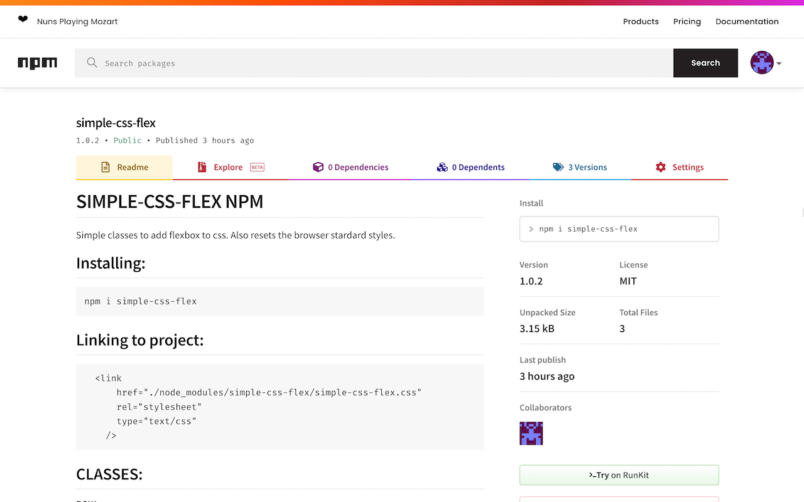

# SIMPLE-CSS-FLEX NPM

Simple classes to add flexbox to css. Also resets the browser stardard styles.

[Npm link here](https://www.npmjs.com/package/simple-css-flex)



## Installing:

```
npm i simple-css-flex
```

## Linking to project:

```
  <link
      href="./node_modules/simple-css-flex/simple-css-flex.css"
      rel="stylesheet"
      type="text/css"
    />
```

## CLASSES:

#### ROW:

1. flexRowXCenterYStart
2. flexRowXCenterYCenter
3. flexRowXCenterEnd
4. flexRowXStartYCenter
5. flexRowXStartYEnd
6. flexRowXStartYStart
7. flexRowXEndYCenter
8. flexRowXEndYEnd
9. flexRowXEndYStart

#### COLUMNS:

1. flexColXStartYCenter
2. flexColXCenterYCenter
3. flexColXEndYCenter
4. flexColXStartYStart
5. flexColXCenterYStart
6. flexColXEndYStart
7. flexColXEndYEnd
8. flexColXStartYEnd
9. flexColXCenterYEnd

#### Any concerns please email: medictansy@gmail.com
